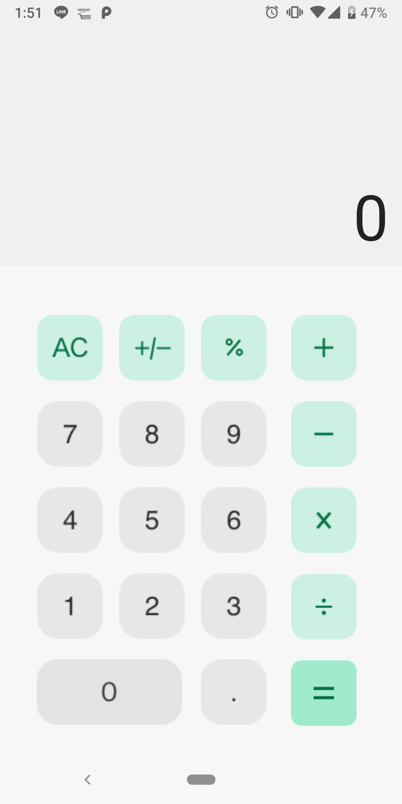
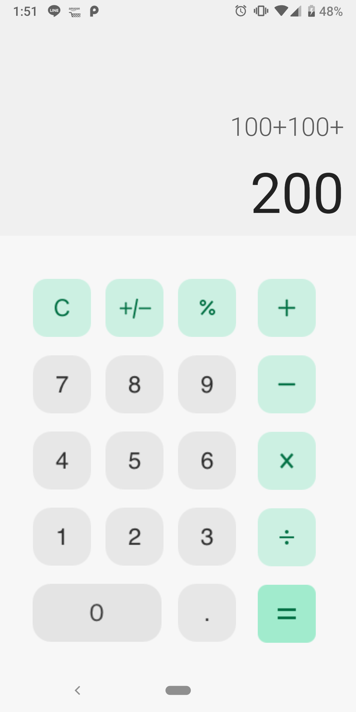

# CalcApp
## 概要
Androidの電卓アプリで、Androidアプリ開発を勉強する為に作りました。

## ビルド環境

- Android SDK 37（Android 17）、minSdk 24（Android 7.0以降）
- Android Studio Panda 3 Patch 1以降、JDK 17以降
- Gradle 9.3.1 / Android Gradle Plugin 9.1.1（Wrapperで固定）
- KotlinはAGP内蔵版を使用。Compose Compilerプラグインのバージョンを合わせる。

SDK ManagerでAndroid SDK Platform 37.0をインストールし、`local.properties` にSDKの場所を設定してください。
Firebaseの `app/google-services.json` も必要です（CIではSecretから生成します）。

```shell
mise exec -- ./gradlew :app:assembleDebug :app:testDebugUnitTest :app:lintDebug
# 端末またはエミュレーターを起動した状態で実行
mise exec -- ./gradlew :app:connectedDebugAndroidTest
```

Google Playの更新用AABは既存のCDワークフローで署名して生成します。
SDK設定を変更しただけでは配信中のアプリは更新されないため、Play Consoleで新しいAABの公開が必要です。

参考: [Google Playの対象API要件](https://developer.android.com/google/play/requirements/target-sdk)、[API 37対応ビルドツール](https://developer.android.com/build/releases/agp-9-1-0-release-notes)。

## スクショ

以下がスクショとなります。

### メイン画面


### 計算中

